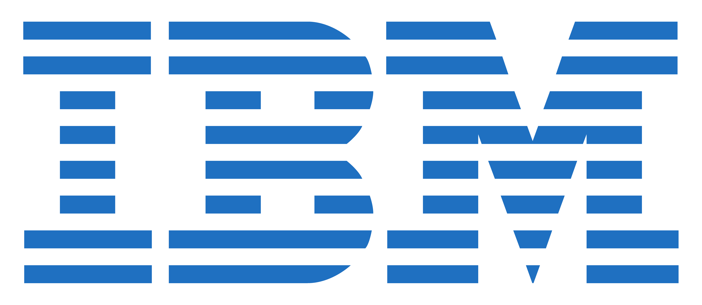

<!-- PROJECT SHIELDS -->

[![Contributors][contributors-shield]][contributors-url]
[![Forks][forks-shield]][forks-url]
[![Stargazers][stars-shield]][stars-url]

<!-- PROJECT LOGO -->
 

  

  <h3 align="center">Smart Waste Management System For Metropolitan Cities</h3>

  

    A Project on Smart Waste Management System For Metropolitan Cities For IBM - Nalaya Thiran
     
    <a href="https://github.com/IBM-EPBL/IBM-Project-11529-1659332969"><strong>Explore the docs »</strong></a>
     
    <a href="https://github.com/IBM-EPBL/IBM-Project-11529-1659332969/issues">Report Bug</a>
  

<!-- ABOUT THE PROJECT -->
## About The Project

[![Product Name Screen Shot][product-screenshot]](https://example.com)

(<a href="#readme-top">back to top</a>)

### Built With

* [![Next][Next.js]][Next-url]
* [![React][React.js]][React-url]
* [![Vue][Vue.js]][Vue-url]
* [![Angular][Angular.io]][Angular-url]
* [![Svelte][Svelte.dev]][Svelte-url]
* [![Laravel][Laravel.com]][Laravel-url]
* [![Bootstrap][Bootstrap.com]][Bootstrap-url]
* [![JQuery][JQuery.com]][JQuery-url]

(<a href="#readme-top">back to top</a>)

<!-- CONTACT -->
## Contact

Sivatharshan T - 19tucs221@skct.edu.in

Project Link: [IBM-Git-Repo](https://github.com/IBM-EPBL/IBM-Project-11529-1659332969)

(<a href="#readme-top">back to top</a>)

<!-- ACKNOWLEDGMENTS -->
## Acknowledgments

Use this space to list resources you find helpful and would like to give credit to. I've included a few of my favorites to kick things off!

* [Choose an Open Source License](https://choosealicense.com)
* [GitHub Emoji Cheat Sheet](https://www.webpagefx.com/tools/emoji-cheat-sheet)
* [Malven's Flexbox Cheatsheet](https://flexbox.malven.co/)
* [Malven's Grid Cheatsheet](https://grid.malven.co/)
* [Img Shields](https://shields.io)
* [GitHub Pages](https://pages.github.com)
* [Font Awesome](https://fontawesome.com)
* [React Icons](https://react-icons.github.io/react-icons/search)

(<a href="#readme-top">back to top</a>)

<!-- MARKDOWN LINKS & IMAGES -->
[contributors-shield]: https://img.shields.io/github/contributors/IBM-EPBL/IBM-Project-11529-1659332969
[contributors-url]: https://github.com/IBM-EPBL/IBM-Project-11529-1659332969/graphs/contributors
[forks-shield]: https://img.shields.io/github/forks/IBM-EPBL/IBM-Project-11529-1659332969
[forks-url]: https://github.com/IBM-EPBL/IBM-Project-11529-1659332969/network/members
[stars-shield]: https://img.shields.io/github/stars/IBM-EPBL/IBM-Project-11529-1659332969?style=flat-square
[stars-url]: https://github.com/IBM-EPBL/IBM-Project-11529-1659332969/stargazers
[product-screenshot]: images/screenshot.png
[Next.js]: https://img.shields.io/badge/next.js-000000?style=for-the-badge&logo=nextdotjs&logoColor=white
[Next-url]: https://nextjs.org/
[React.js]: https://img.shields.io/badge/React-20232A?style=for-the-badge&logo=react&logoColor=61DAFB
[React-url]: https://reactjs.org/
[Vue.js]: https://img.shields.io/badge/Vue.js-35495E?style=for-the-badge&logo=vuedotjs&logoColor=4FC08D
[Vue-url]: https://vuejs.org/
[Angular.io]: https://img.shields.io/badge/Angular-DD0031?style=for-the-badge&logo=angular&logoColor=white
[Angular-url]: https://angular.io/
[Svelte.dev]: https://img.shields.io/badge/Svelte-4A4A55?style=for-the-badge&logo=svelte&logoColor=FF3E00
[Svelte-url]: https://svelte.dev/
[Laravel.com]: https://img.shields.io/badge/Laravel-FF2D20?style=for-the-badge&logo=laravel&logoColor=white
[Laravel-url]: https://laravel.com
[Bootstrap.com]: https://img.shields.io/badge/Bootstrap-563D7C?style=for-the-badge&logo=bootstrap&logoColor=white
[Bootstrap-url]: https://getbootstrap.com
[JQuery.com]: https://img.shields.io/badge/jQuery-0769AD?style=for-the-badge&logo=jquery&logoColor=white
[JQuery-url]: https://jquery.com 
